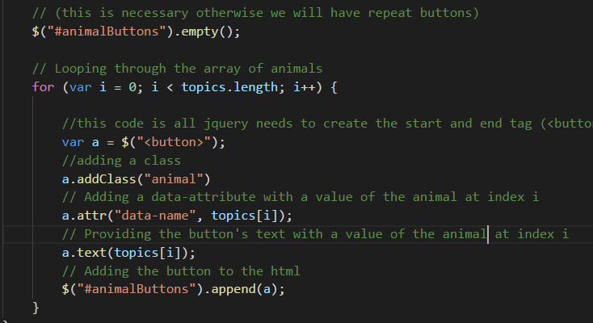

# giphyapi

In this project I used the GIPHY API to make a dynamic webpage that populates with animal gifs.  The giphy api is called in addition to using AJAX and jQuery to change the HTML of my site.

  
 
 

 
 

 What I did to start is to create an array of strings related to animals.&nbsp; The app takes elements in my array and creates buttons in my HTML using jQuery and AJAX in the javascript file. &nbsp;I'm using a for loop that appends a button for each string in the array.&nbsp; Here is an example using my for loop. &nbsp; This makes it much more efficiant than trying to create all the buttons individually:
 
 

